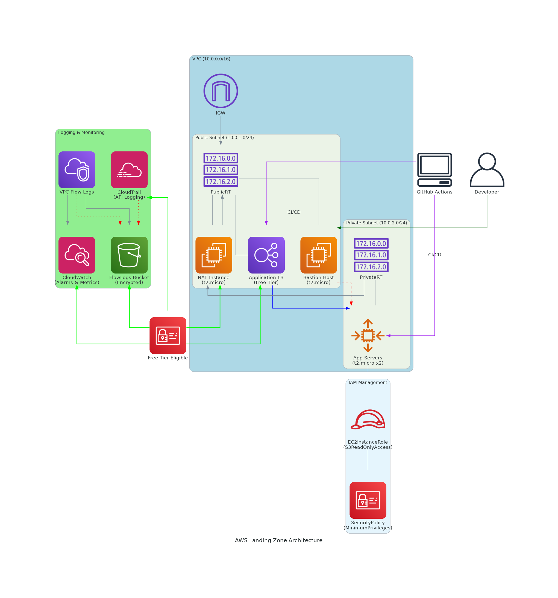

# AWS Landing Zone with Terraform


A Terraform project to deploy a free-tier compliant AWS landing zone with VPC networking, EC2 compute, and centralized logging.

## Project Phases

### Phase 1: Development Environment Setup
**Objective**: Manual deployment of core infrastructure in dev environment

#### Resources Created:
- VPC with public subnets
- Internet Gateway
- Route tables and associations

#### How to Deploy:
```bash
cd environments/dev
terraform init
terraform plan
terraform apply
```

### Phase 2: Compute and Logging
**Objective**: Add EC2 instances and centralized logging

#### Resources Added:
- EC2 instances (t2.micro)
- Security Groups
- VPC Flow Logs to S3
- CloudWatch logging

#### Implementation:
```bash
# After Phase 1 completes
terraform apply -target=module.compute
terraform apply -target=module.logging
```

### Phase 3: Production Environment
**Objective**: Deploy production infrastructure with isolation

#### Key Differences from Dev:
- Separate VPC CIDR (10.1.0.0/16)
- Stricter security configurations
- Environment-specific tagging

#### Deployment:
```bash
cd environments/prod
terraform init
terraform apply
```

### Phase 4: CI/CD with GitHub Actions
**Objective**: Automate deployments via GitHub workflows

#### Features:
- Auto-plan on push to dev branch
- Auto-apply on push to prod branch
- State management using S3 backend

#### Setup:
1. Add AWS credentials to GitHub Secrets:
   - `AWS_ACCESS_KEY_ID`
   - `AWS_SECRET_ACCESS_KEY`

2. Push to trigger workflows:
```bash
git push origin dev   # Triggers plan
git push origin prod  # Triggers apply
```

## Project Structure

```
aws-landing-zone/
├── environments/
│   ├── dev/          # Development environment
│   │   ├── main.tf
│   │   ├── variables.tf
│   │   └── outputs.tf
│   │
│   ├── prod/         # Production environment
│   │   ├── main.tf
│   │   ├── variables.tf
│   │   └── outputs.tf
│   │
│   └── modules/      # Reusable components
│       ├── networking/
│       ├── compute/
│       └── logging/
│
├── .github/
│   └── workflows/    # CI/CD pipelines
│       └── terraform.yml
│
└── README.md
```

## Prerequisites

- Terraform >= 1.0
- AWS Account with IAM permissions
- AWS CLI configured
- GitHub repository

## Project Workflow


## Getting Started

1. Clone the repository:
```bash
git clone https://github.com/98-Anas/aws_landing_zone.git
cd aws_landing_zone
```

2. Initialize Terraform:
```bash
cd environments/dev
terraform init
```

3. Deploy development environment:
```bash
terraform apply
```

## Best Practices

1. **State Management**:
   - Never commit `.tfstate` files
   - Use S3 backend with DynamoDB locking

2. **Security**:
   - Restrict IAM permissions in production
   - Use environment variables for secrets

3. **Cost Control**:
   - Monitor Free Tier usage
   - Set AWS billing alerts

## Cleanup

To destroy all resources:
```bash
terraform destroy
```